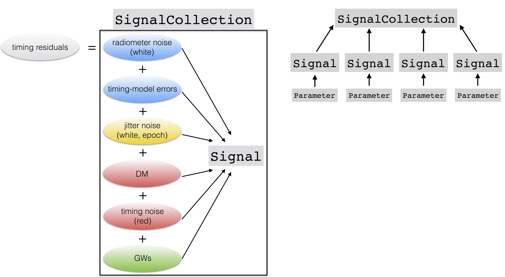
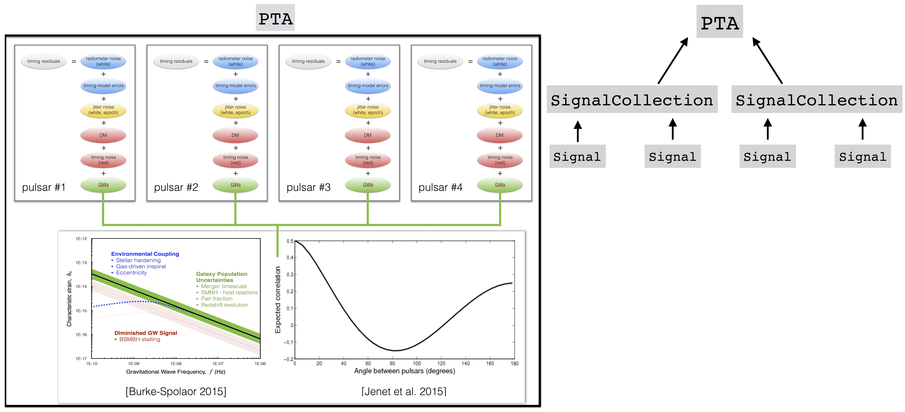

.. module:: enterprise

.. note:: This tutorial was generated from a Jupyter notebook that can be
          downloaded `here <_static/notebooks/data.ipynb>`_.

.. _data:

``enterprise`` Data Structures
==============================

This guide will give an introduction to the unique data structures used
in ``enterprise``. These are all designed with the goal of making this
code as user-friendly as possible, both for the end user and the
developer.

Class Factories
---------------

The ``enterprise`` code makes heavy use of so-called class factories.
Class factories are functions that return classes (not objects of class
instances). A simple example is as follows:

.. code:: python

    def A(farg1, farg2):
        class A(object):
            
            def __init__(self, iarg):
                self.iarg = iarg
            
            def print_info(self):
                print('Object instance {}\nInstance argument: {}\nFunction args: {} {}\n'.format(
                    self, self.iarg, farg1, farg2))
        return A

.. code:: python

    # define class A with arguments that can be seen within the class
    a = A('arg1', 'arg2')
    
    # instantiate 2 instances of class A with different arguments
    a1 = a('iarg1')
    a2 = a('iarg2')
    
    # call print_info method
    a1.print_info()
    a2.print_info()

.. parsed-literal::

    Object instance <__main__.A object at 0x10bb64290>
    Instance argument: iarg1
    Function args: arg1 arg2
    
    Object instance <__main__.A object at 0x10bb642d0>
    Instance argument: iarg2
    Function args: arg1 arg2
    

In the example above we see that the arguments ``arg1`` and ``arg2`` are
seen by both instances ``a1`` and ``a2``; however these instances were
intantiated with different input arguments ``iarg1`` and ``iarg2``. So
we see that class-factories are great when we want to give “global”
parameters to a class without having to pass them on initialization.
This also allows us to mix and match classes, as we will do in
``enterprise`` before we instantiate them.

The ``Pulsar`` class
--------------------

The ``Pulsar`` class is a simple data structure that stores all of the
important information about a pulsar that is obtained from a timing
package such as the TOAs, residuals, error-bars, flags, design matrix,
etc.

This class is instantiated with a par and a tim file. Full documentation
on this class can be found
`here. <enterprise.html#module-enterprise.pulsar>`__

.. code:: python

    psr = Pulsar(datadir+'/B1855+09_NANOGrav_9yv1.gls.par', datadir+'/B1855+09_NANOGrav_9yv1.tim')

This ``Pulsar`` object is then passed to other ``enterprise`` data
structures in a loosley coupled way in order to interact with the pulsar
data.

The ``Parameter`` class
-----------------------

In ``enterprise`` signal parameters are set by specifying a prior
distribution (i.e., Uniform, Normal, etc.). These ``Parameter``\ s are
how ``enterprise`` builds signals. Below we will give an example of this
functionality.

.. code:: python

    # lets define an efac parameter with a uniform prior from [0.5, 5]
    efac = parameter.Uniform(0.5, 5)
    print(efac)

.. parsed-literal::

    <class 'enterprise.signals.parameter.Uniform'>

``Uniform`` is a class factory that returns a class. The parameter is
then intialized via a name. This way, a single parameter class can be
initialized for multiple signal parameters with different names
(i.e. EFAC per observing backend, etc). Once the parameter is
initialized then you then have access to many useful methods.

.. code:: python

    # initialize efac parameter with name "efac_1"
    efac1 = efac('efac_1')
    print(efac1)
    
    # return parameter name
    print(efac1.name)
    
    # get pdf at a point (log pdf is access)
    print(efac1.get_pdf(1.3), efac1.get_logpdf(1.3))
    
    # return 5 samples from this prior distribution
    print(efac1.sample(n=5))

.. parsed-literal::

    "efac_1":Uniform(0.5,5)
    efac_1
    (0.22222222222222221, -1.5040773967762742)
    [ 4.15875031  4.02527174  0.86093696  2.29835222  3.14076572]

The ``Function`` structure
--------------------------

In ``enterprise`` we have defined a special data structure called
``Function``. This data structure provides the user with a way to use
and combine several different ``enterprise`` components in a user
friendly way. More explicitly, it converts and standard function into an
``enterprise`` ``Function`` which can extract information from the
``Pulsar`` object and can also interact with ``enterprise``
``Parameter``\ s.

[**put reference to docstring here**]

For example, consider the function:

.. code:: python

    @signal_base.function
    def sine_wave(toas, log10_A=-7, log10_f=-8):
        return 10**log10_A * np.sin(2*np.pi*toas*10**log10_f)

Notice that the first positional argument of the function is ``toas``,
which happens to be a name of an attribute in the ``Pulsar`` class and
the keyword arguments specify the default parameters for this function.

The decorator converts this standard function to a ``Function`` which
can be used in two ways: the first way is to treat it like any other
function.

.. code:: python

    # treat it just as a standard function with a vector input
    sw = sine_wave(np.array([1,2,3]), log10_A=-8, log10_f=-7.5)
    print(sw)

.. parsed-literal::

    [  1.98691765e-15   3.97383531e-15   5.96075296e-15]

the second way is to use it as a ``Function``:

.. code:: python

    # or use it as an enterprise function
    sw_function = sine_wave(log10_A=parameter.Uniform(-10,-5), log10_f=parameter.Uniform(-9, -7))
    print(sw_function)

.. parsed-literal::

    <class 'enterprise.signals.signal_base.Function'>

Here we see that ``Function`` is actually a class factory, that is, when
initialized with ``enterprise`` ``Parameter``\ s it returns a class that
is initialized with a name and a ``Pulsar`` object as follows:

.. code:: python

    sw2 = sw_function('sine_wave', psr=psr)
    print(sw2)

.. parsed-literal::

    <enterprise.signals.signal_base.Function object at 0x109da10d0>

Now this ``Function`` object carries around instances of the
``Parameter`` classes given above for this particular function and
``Pulsar``

.. code:: python

    print(sw2.params)

.. parsed-literal::

    ["sine_wave_log10_A":Uniform(-10,-5), "sine_wave_log10_f":Uniform(-9,-7)]

Most importantly it can be called in three different ways: If given
without parameters it will fall back on the defaults given in the
original function definition

.. code:: python

    print(sw2())

.. parsed-literal::

    [  5.97588901e-08   5.97588901e-08   5.97588901e-08 ...,  -5.80521219e-08
      -5.80521219e-08  -5.80521219e-08]

or we can give it new fixed parameters

.. code:: python

    print(sw2(log10_A=-8, log10_f=-6.5))

.. parsed-literal::

    [ -7.23515356e-09  -7.23515356e-09  -7.23515356e-09 ...,   5.93768399e-09
       5.93768399e-09   5.93768399e-09]

or most importantly we can give it a parameter dictionary with the
``Parameter`` names as keys. This is how ``Function``\ s are use
internally inside ``enterprise``.

.. code:: python

    params = {'sine_wave_log10_A':-8, 'sine_wave_log10_f':-6.5}
    print(sw2(params=params))

.. parsed-literal::

    [ -7.23515356e-09  -7.23515356e-09  -7.23515356e-09 ...,   5.93768399e-09
       5.93768399e-09   5.93768399e-09]

Notice that the last two methods give the same answer since we gave it
the same values just in different ways. So you may be thinking: “Why did
we pass the ``Pulsar`` object on initialization?” or “Wait. How does it
know about the toas?!”. Well the first question answers the second. By
passing the pulsar object it grabs the ``toas`` attribute internally.
This feature, combined with the ability to recognize ``Parameter``\ s
and the ability to call the original function as we always would are the
main strengths of ``Function``, which is used heavily in ``enterprise``.

Note that if we define a function without the decorator then we can
still obtain a ``Function`` via:

.. code:: python

    def sine_wave(toas, log10_A=-7, log10_f=-8):
        return 10**log10_A * np.sin(2*np.pi*toas*10**log10_f)
    
    sw3 = signal_base.Function(sine_wave, log10_A=parameter.Uniform(-10,-5), 
                               log10_f=parameter.Uniform(-9, -7))
    
    print(sw3)

.. parsed-literal::

    <class 'enterprise.signals.signal_base.Function'>

Make your own ``Function``
~~~~~~~~~~~~~~~~~~~~~~~~~~

To define your own ``Function`` all you have to do is to define a
function with these rules in mind.

1. If you want to use ``Pulsar`` attributes, define them as positional
   arguments with the same name as used in the ``Pulsar`` class (see
   `here <enterprise.html#module-enterprise.pulsar>`__ for more
   information.
2. Any arguments that you may use as ``Parameter``\ s must be keyword
   arguments (although you can have others that aren’t ``Parameter``\ s)
3. Add the ``@function`` decorator.

And thats it! You can now define your own ``Function``\ s with minimal
overhead and use them in ``enterprise`` or for tests and simulations or
whatever you want!

The ``Selection`` structure
---------------------------

In the course of our analysis it is useful to split different signals
into pieces. The most common flavor of this is to split the white noise
parameters (i.e., EFAC, EQUAD, and ECORR) by observing backend system.
The ``Selection`` structure is here to make this as smooth and versatile
as possible.

The ``Selection`` structure is also a class-factory that returns a
specific selection dictionary with keys and Boolean arrays as values.

This will become more clear with an example. Lets say that you want to
split our parameters between the first and second half of the dataset,
then we can define the following function:

.. code:: python

    def cut_half(toas):
        midpoint = (toas.max() + toas.min()) / 2
        return dict(zip(['t1', 't2'], [toas <= midpoint, toas > midpoint]))

This function will return a dictionary with keys (i.e. the names of the
different subsections) ``t1`` and ``t2`` and boolean arrays
corresponding to the first and second halves of the data span,
respectively. So for a simple input we have:

.. code:: python

    toas = np.array([1,2,3,4])
    print(cut_half(toas))

.. parsed-literal::

    {'t2': array([False, False,  True,  True], dtype=bool), 't1': array([ True,  True, False, False], dtype=bool)}

To pass this to ``enterprise`` we turn it into a ``Selection`` via:

.. code:: python

    ch = Selection(cut_half)
    print(ch)

.. parsed-literal::

    <class 'enterprise.signals.selections.Selection'>

As we have stated, this is class factory that will be initialized inside
``enterprise`` signals with a ``Pulsar`` object in a very similar way to
``Function``\ s.

.. code:: python

    ch1 = ch(psr)
    print(ch1)
    print(ch1.masks)

.. parsed-literal::

    <enterprise.signals.selections.Selection object at 0x1048212d0>
    {'t2': array([False, False, False, ...,  True,  True,  True], dtype=bool), 't1': array([ True,  True,  True, ..., False, False, False], dtype=bool)}

The ``Selection`` object has a method ``masks`` that uses the ``Pulsar``
object to evaluate the arguments of ``cut_half`` (these can be any
number of ``Pulsar`` attributes, not just ``toas``). The ``Selection``
object can also be called to return initialized ``Parameter``\ s with
the split names as follows:

.. code:: python

    # make efac class factory
    efac = parameter.Uniform(0.1, 5.0)
    
    # now give it to selection
    params, masks = ch1('efac', efac)
    
    # named parameters
    print(params)
    
    # named masks
    print(masks)

.. parsed-literal::

    {u't1_efac': "B1855+09_t1_efac":Uniform(0.1,5.0), u't2_efac': "B1855+09_t2_efac":Uniform(0.1,5.0)}
    {u't1_efac': array([ True,  True,  True, ..., False, False, False], dtype=bool), u't2_efac': array([False, False, False, ...,  True,  True,  True], dtype=bool)}

Make your own ``Selection``
~~~~~~~~~~~~~~~~~~~~~~~~~~~

To define your own ``Selection`` all you have to do is to define a
function with these rules in mind.

1. If you want to use ``Pulsar`` attributes, define them as positional
   arguments with the same name as used in the ``Pulsar`` class (see
   `here <enterprise.html#module-enterprise.pulsar>`__ for more
   information.
2. Make sure the return value is a dictionary with the names you want
   for the different segments and values as boolean arrays specifying
   which points to apply the split to.
3. A selection does not have to apply to all points. You can make it
   apply to only single points or single segments if you wish.

And thats it! You can now define your own ``Selection``\ s with minimal
overhead and use them in ``enterprise`` or for tests and simulations or
whatever you want!

``Signal``\ s, ``SignalCollection``\ s, and ``PTA``\ s oh my!
-------------------------------------------------------------

|image0|

-  The data (residuals) are modeled as the sum of ``Signal`` components
   which have their own ``Parameter``\ s.
-  The sum of all ``Signal`` components is a ``SignalCollection``.

|image0|

-  Each pulsar’s model is a ``SignalCollection`` that are combined to
   form a ``PTA``.
-  Common ``Signal``\ s are shared across pulsars
-  ``Likelihood``\ s act on ``PTA``\ s.

Anatomy of an ``enterprise`` ``Signal``
~~~~~~~~~~~~~~~~~~~~~~~~~~~~~~~~~~~~~~~

-  :math:`\delta\tau = \sum_{i} X(\phi_{\rm basis})_{(i)}w_{(i)} + s(\phi_{\rm det}) + n(\phi_{\rm white})`
-  :math:`w_{(i)} | K_{(i)} = \mathrm{Normal}(0, K(\phi_{\rm gp})_{(i)})`

.. code:: python

    class Signal(object):
        """Base class for Signal objects."""

        def get_ndiag(self, params):
            """Returns the diagonal of the white noise vector `N`.
            This method also supports block diagaonal sparse matrices.
            """
            return None

        def get_delay(self, params):
            """Returns the waveform of a deterministic signal."""
            return 0

        def get_basis(self, params=None):
            """Returns the basis array of shape N_toa x N_basis."""
            return None

        def get_phi(self, params):
            """Returns a diagonal or full rank covaraince matrix 
            of the basis amplitudes."""
            return None

        def get_phiinv(self, params):
            """Returns inverse of the covaraince of basis amplitudes."""
            return None
