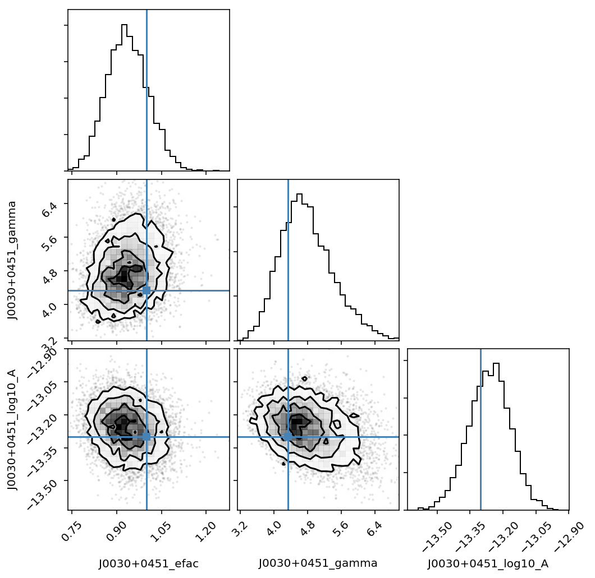
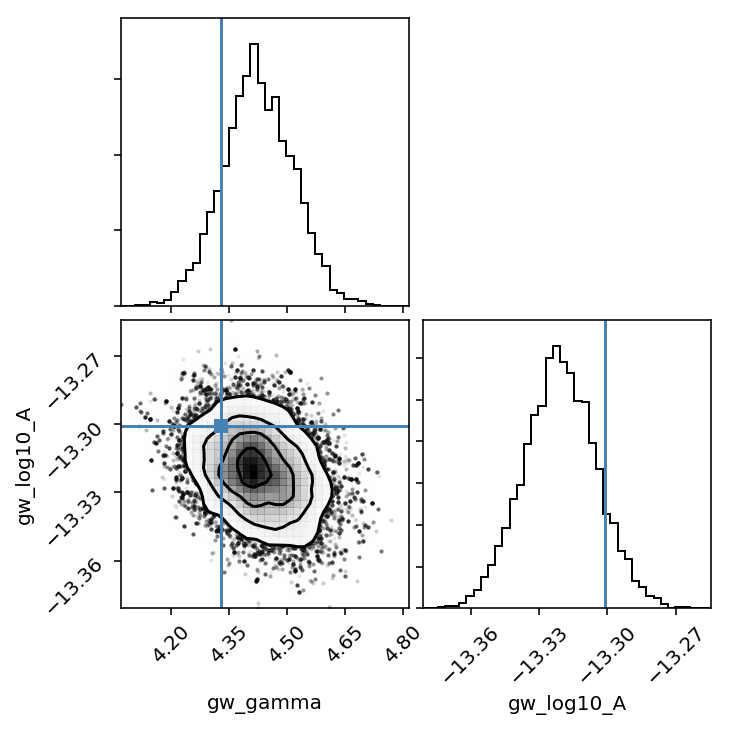

.. module:: enterprise

.. note:: This tutorial was generated from a Jupyter notebook that can be
          downloaded `here <_static/notebooks/mdc.ipynb>`_.

.. _mdc:

Analyzing Open MDC data
=======================

In this tutorial we will use ``enterprise`` to analyze open MDC dataset
1.

Get par and tim files
---------------------

The first step in the process is getting the open MDC1 par and tim files
in the tests directory.

.. code:: python

    parfiles = sorted(glob.glob(datadir + '/*.par'))
    timfiles = sorted(glob.glob(datadir + '/*.tim'))

Load pulsars into ``Pulsar`` objects
------------------------------------

``enterprise`` uses a specific
`Pulsar <'../../_build/html/data.html#the-pulsar-class'>`__ object to
store all of the relevant pulsar information (i.e. TOAs, residuals,
error bars, flags, etc) from the timing package. Eventually
``enterprise`` will support both ``PINT`` and ``tempo2``; however, for
the moment it only supports ``tempo2`` through the
`libstempo <https://github.com/vallis/libstempo>`__ package. This object
is then used to initalize ``Signal``\ s that define the generative model
for the pulsar residuals. This is in keeping with the overall
``enterprise`` philosophy that the pulsar data should be as loosley
coupled as possible to the pulsar model.

.. code:: python

    psrs = []
    for p, t in zip(parfiles, timfiles):
        psr = Pulsar(p, t)
        psrs.append(psr)

Setup and run a simple noise model on a single pulsar
-----------------------------------------------------

Here we will demonstrate how to do a simple noise run on a single
pulsar. In this analysis we will simply model the noise via a single
EFAC parameter and a power-law red noise process.

Set up model
~~~~~~~~~~~~

Here we see the basic ``enterprise`` model building steps:

1. Define parameters and priors (This makes use of the `Parameter class
   factory <'../../_build/html/data.html#the-parameter-class'>`__)
2. Set up the signals making use of the ``Signal`` class factories.
3. Define the model by summing the individual ``Signal`` classes.
4. Define a PTA by initializing the signal model with a ``Pulsar``
   object.

Notice that ``powerlaw`` is uses as a
`Function <'../../_build/html/data.html#the-function-structure'>`__
here.

.. code:: python

    ##### parameters and priors #####
    
    # Uniform prior on EFAC
    efac = parameter.Uniform(0.1, 5.0)
    
    # red noise parameters 
    # Uniform in log10 Amplitude and in spectral index
    log10_A = parameter.Uniform(-18,-12)
    gamma = parameter.Uniform(0,7)
    
    ##### Set up signals #####
    
    # white noise
    ef = white_signals.MeasurementNoise(efac=efac)
    
    # red noise (powerlaw with 30 frequencies)
    pl = utils.powerlaw(log10_A=log10_A, gamma=gamma)
    rn = gp_signals.FourierBasisGP(spectrum=pl, components=30)
    
    # timing model
    tm = gp_signals.TimingModel()
    
    # full model is sum of components
    model = ef + rn + tm 
    
    # initialize PTA
    pta = signal_base.PTA([model(psrs[0])])

We can see which parameters we are going to be searching over with:

.. code:: python

    print(pta.params)

.. parsed-literal::

    ["J0030+0451_efac":Uniform(0.1,5.0), "J0030+0451_gamma":Uniform(0,7), "J0030+0451_log10_A":Uniform(-18,-12)]

Get initial parameters
~~~~~~~~~~~~~~~~~~~~~~

We will start our MCMC chain at a random point in parameter space. We
accomplish this by setting up a parameter dictionary using the ``name``
and ``sample`` methods for each ``Parameter``.

.. code:: python

    xs = {par.name: par.sample() for par in pta.params}
    print(xs)

.. parsed-literal::

    {u'J0030+0451_efac': 4.7352650698633516, u'J0030+0451_gamma': 3.8216965873513029, u'J0030+0451_log10_A': -15.161366939011094}

Note that the rest of the analysis here is dependent on the sampling
method and not on ``enterprise`` itself.

Set up sampler
~~~~~~~~~~~~~~

Here we are making use of the
`PTMCMCSampler <https://github.com/jellis18/PTMCMCSampler>`__ package
for sampling. For this sampler, as in many others, it requires a
function to compute the log-likelihood and log-prior given a vector of
parameters. Here, these are supplied by ``PTA`` as
``pta.get_lnlikelihood`` and ``pta.get_lnprior``.

.. code:: python

    # dimension of parameter space
    ndim = len(xs)
    
    # initial jump covariance matrix
    cov = np.diag(np.ones(ndim) * 0.01**2)
    
    # set up jump groups by red noise groups 
    ndim = len(xs)
    groups  = [range(0, ndim)]
    groups.extend([[1,2]])
    
    # intialize sampler
    sampler = ptmcmc(ndim, pta.get_lnlikelihood, pta.get_lnprior, cov, groups=groups, 
                     outDir='chains/mdc/open1/')

Sample!
~~~~~~~

.. code:: python

    # sampler for N steps
    N = 100000
    x0 = np.hstack(p.sample() for p in pta.params)
    sampler.sample(x0, N, SCAMweight=30, AMweight=15, DEweight=50)

.. parsed-literal::

    Finished 10.00 percent in 7.578883 s Acceptance rate = 0.27876Adding DE jump with weight 50
    Finished 99.00 percent in 77.849424 s Acceptance rate = 0.404505
    Run Complete

Examine chain output
~~~~~~~~~~~~~~~~~~~~

We see here that we have indeed recovered the injected values!

.. code:: python

    chain = np.loadtxt('chains/mdc/open1/chain_1.txt')
    pars = sorted(xs.keys())
    burn = int(0.25 * chain.shape[0])

.. code:: python

    truths = [1.0, 4.33, np.log10(5e-14)]
    corner.corner(chain[burn:,:-4], 30, truths=truths, labels=pars);

Run full PTA GWB analysis
-------------------------

Here we will use the full 36 pulsar PTA to conduct a search for the GWB.
In this analysis we fix the EFAC=1 for simplicity (and since we already
know the answer!). This shows an example of how to use ``Constant``
parameters in ``enterprise``.

Here you notice some of the simplicity of ``enterprise``. For the most
part, setting up the model for the full PTA is identical to that for one
pulsar. In this case the only differences are that we are specifying the
timespan to use when setting the GW and red noise frequencies and we are
including a ``FourierBasisCommonGP`` signal, which models the GWB
spectrum and spatial correlations.

After this setup, the rest is nearly identical to the single pulsar run
above.

.. code:: python

    # find the maximum time span to set GW frequency sampling
    tmin = [p.toas.min() for p in psrs]
    tmax = [p.toas.max() for p in psrs]
    Tspan = np.max(tmax) - np.min(tmin)
    
    ##### parameters and priors #####
    
    # white noise parameters
    # in this case we just set the value here since all efacs = 1 
    # for the MDC data
    efac = parameter.Constant(1.0)
    
    # red noise parameters 
    log10_A = parameter.Uniform(-18,-12)
    gamma = parameter.Uniform(0,7)
    
    ##### Set up signals #####
    
    # white noise
    ef = white_signals.MeasurementNoise(efac=efac)
    
    # red noise (powerlaw with 30 frequencies)
    pl = utils.powerlaw(log10_A=log10_A, gamma=gamma)
    rn = gp_signals.FourierBasisGP(spectrum=pl, components=30, Tspan=Tspan)
    
    # gwb
    # We pass this signal the power-law spectrum as well as the standard 
    # Hellings and Downs ORF
    orf = utils.hd_orf()
    crn = gp_signals.FourierBasisCommonGP(pl, orf, components=30, name='gw', Tspan=Tspan)
    
    # timing model
    tm = gp_signals.TimingModel()
    
    # full model is sum of components
    model = ef + rn + tm  + crn
    
    # initialize PTA
    pta = signal_base.PTA([model(psr) for psr in psrs])

Set up sampler
~~~~~~~~~~~~~~

.. code:: python

    # initial parameters
    xs = {par.name: par.sample() for par in pta.params}
    
    # dimension of parameter space
    ndim = len(xs)
    
    # initial jump covariance matrix
    cov = np.diag(np.ones(ndim) * 0.01**2)
    
    # set up jump groups by red noise groups 
    ndim = len(xs)
    groups  = [range(0, ndim)]
    groups.extend(map(list, zip(range(0,ndim,2), range(1,ndim,2))))
    
    sampler = ptmcmc(ndim, pta.get_lnlikelihood, pta.get_lnprior, cov, groups=groups, 
                     outDir='chains/mdc/open1_gwb/')

.. code:: python

    # sampler for N steps
    N = 100000
    x0 = np.hstack(p.sample() for p in pta.params)
    sampler.sample(x0, N, SCAMweight=30, AMweight=15, DEweight=50)

Plot output
~~~~~~~~~~~

.. code:: python

    chain = np.loadtxt('chains/mdc/open1_gwb/chain_1.txt')
    pars = sorted(xs.keys())
    burn = int(0.25 * chain.shape[0])

.. code:: python

    corner.corner(chain[burn:,-6:-4], 40, labels=pars[-2:], smooth=True, truths=[4.33, np.log10(5e-14)]);

