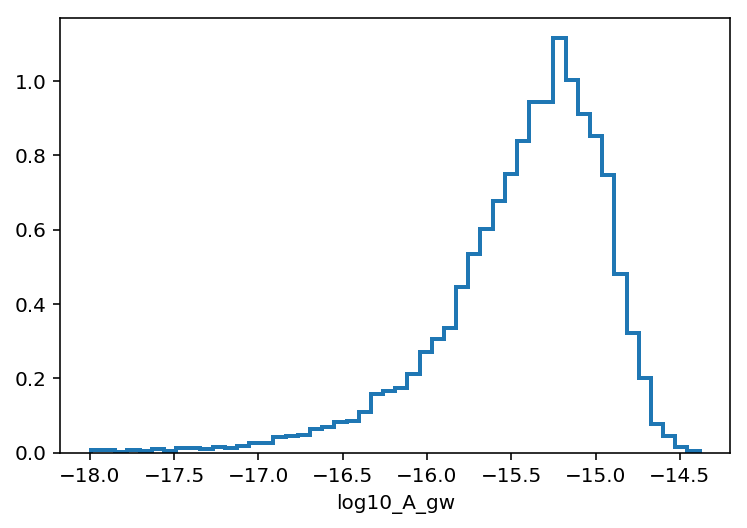

.. module:: enterprise

.. note:: This tutorial was generated from a Jupyter notebook that can be
          downloaded `here <_static/notebooks/nano9.ipynb>`_.

.. _nano9:

Analyzing 9-year NANOGrav data
==============================

In this tutorial we will use ``enterprise`` to analyze the `NANOGrav
9-year data release <https://data.nanograv.org>`__ for a stochastic GW
background. We will reproduce the power-law GWB limit from `this
paper. <http://adsabs.harvard.edu/cgi-bin/bib_query?arXiv:1508.03024>`__

Function to convert PAL2 noise parameters to enterprise parameter dict
~~~~~~~~~~~~~~~~~~~~~~~~~~~~~~~~~~~~~~~~~~~~~~~~~~~~~~~~~~~~~~~~~~~~~~

.. code:: python

    def get_noise_from_pal2(noisefile):
        psrname = noisefile.split('/')[-1].split('_noise.txt')[0]
        fin = open(noisefile, 'r')
        lines = fin.readlines()
        params = {}
        for line in lines:
            ln = line.split()
            if 'efac' in line:
                par = 'efac'
                flag = ln[0].split('efac-')[-1]
            elif 'equad' in line:
                par = 'log10_equad'
                flag = ln[0].split('equad-')[-1]
            elif 'jitter_q' in line:
                par = 'log10_ecorr'
                flag = ln[0].split('jitter_q-')[-1]
            elif 'RN-Amplitude' in line:
                par = 'log10_A'
                flag = ''
            elif 'RN-spectral-index' in line:
                par = 'gamma'
                flag = ''
            else:
                break
            if flag:
                name = [psrname, flag, par]
            else:
                name = [psrname, par]
            pname = '_'.join(name)
            params.update({pname: float(ln[1])})
        return params

Get par, tim, and noise files
~~~~~~~~~~~~~~~~~~~~~~~~~~~~~

Here we collect the tim and par files as well as noise files made from
the ``PAL2`` code. These are the same par, tim, and noise files used in
the 9-year analysis papers. We use the convienience function above to
convert from ``PAL2`` noise files to ``enterprise`` parameter
dictionaries.

.. code:: python

    parfiles = sorted(glob.glob(datadir + '/*.par'))
    timfiles = sorted(glob.glob(datadir + '/*.tim'))
    noisefiles = sorted(glob.glob(datadir + '/*noise.txt'))
    
    # 18 pulsars used in 9 year analysis
    p9 = np.loadtxt(datadir+'/9yr_pulsars.txt', dtype='S42')
    
    # filter
    parfiles = [x for x in parfiles if x.split('/')[-1].split('_')[0] in p9]
    timfiles = [x for x in timfiles if x.split('/')[-1].split('_')[0] in p9]
    noisefiles = [x for x in noisefiles if x.split('/')[-1].split('_')[0] in p9]

Load into Pulsar class list
~~~~~~~~~~~~~~~~~~~~~~~~~~~

.. code:: python

    psrs = []
    for p, t in zip(parfiles, timfiles):
        psr = Pulsar(p, t, ephem='DE421')
        psrs.append(psr)

Get parameter dict from noisefiles
~~~~~~~~~~~~~~~~~~~~~~~~~~~~~~~~~~

.. code:: python

    params = {}
    for nfile in noisefiles:
        params.update(get_noise_from_pal2(nfile))

Set up model
~~~~~~~~~~~~

When setting up the model for our upper limit run we fix all of the
white noise (EFAC, EQUAD, and ECORR) parameters to the values obtained
from the noise files. This is done by using ``Constant`` parameters. In
this case we do not specify a default value for all instances of that
parameter but instead will set them, based on their initialized pulsar
and backend specific name, later via the ``set_default_params`` method
of ``PTA``.

Speaking of white noise parameters here, we also use the ``Selection``
object.

Another feature to notice is that we do not use a uniform prior on the
log of the red noise or GWB amplitude. Instead we use a ``LinearExp``
prior (short for linear-exponent prior), that is a prior of the form
:math:`p(x)\propto 10^x`. This is how we can still use the log of the
parameter to sample but place a uniform prior on the parameter itself.
We do this for both the red noise and GWB amplitude parameters.

Next, in order to save on computing time we do not include spatial
correlations here. Instead we model the GWB as a common red process
across all pulsars. In ``enterprise`` we can do this with a simple
trick. We pre-initialize the parameters before passing them to the
``Signal`` model. In this way the *same* parameter instance is used for
all pulsars. Lastly, we fixt the spectral index of the GWB to be 13/3
(4.33) using the ``Constant`` parameter.

.. code:: python

    # find the maximum time span to set GW frequency sampling
    tmin = [p.toas.min() for p in psrs]
    tmax = [p.toas.max() for p in psrs]
    Tspan = np.max(tmax) - np.min(tmin)
    
    # selection class to break white noise by backend
    selection = selections.Selection(selections.by_backend)
    
    ##### parameters and priors #####
    
    # white noise parameters
    # since we are fixing these to values from the noise file we set
    # them as constant parameters
    efac = parameter.Constant()
    equad = parameter.Constant()
    ecorr = parameter.Constant()
    
    # red noise parameters 
    log10_A = parameter.LinearExp(-20,-12)
    gamma = parameter.Uniform(0,7)
    
    # GW parameters (initialize with names here to use parameters in common across pulsars)
    log10_A_gw = parameter.LinearExp(-18,-12)('log10_A_gw')
    gamma_gw = parameter.Constant(4.33)('gamma_gw')
    
    ##### Set up signals #####
    
    # white noise
    ef = white_signals.MeasurementNoise(efac=efac, selection=selection)
    eq = white_signals.EquadNoise(log10_equad=equad, selection=selection)
    ec = white_signals.EcorrKernelNoise(log10_ecorr=ecorr, selection=selection)
    
    # red noise (powerlaw with 30 frequencies)
    pl = utils.powerlaw(log10_A=log10_A, gamma=gamma)
    rn = gp_signals.FourierBasisGP(spectrum=pl, components=30, Tspan=Tspan)
    
    # gwb (no spatial correlations)
    cpl = utils.powerlaw(log10_A=log10_A_gw, gamma=gamma_gw)
    gw = gp_signals.FourierBasisGP(spectrum=cpl, components=30, Tspan=Tspan)
    
    # for spatial correltions you can do...
    #orf = utils.hd_orf()
    #crn = gp_signals.FourierBasisCommonGP(cpl, orf, components=30, name='gw', Tspan=Tspan)
    
    # timing model
    tm = gp_signals.TimingModel()
    
    # to add solar system ephemeris modeling...
    #eph = deterministic_signals.PhysicalEphemerisSignal(use_epoch_toas=True)
    
    # full model is sum of components
    model = ef + eq + ec + rn + tm + gw
    
    # intialize PTA
    pta = signal_base.PTA([model(psr) for psr in psrs])

Set white noise parameters
~~~~~~~~~~~~~~~~~~~~~~~~~~

.. code:: python

    pta.set_default_params(params)

Set initial parameters drawn from prior and evaluate likelihood to fill caches
~~~~~~~~~~~~~~~~~~~~~~~~~~~~~~~~~~~~~~~~~~~~~~~~~~~~~~~~~~~~~~~~~~~~~~~~~~~~~~

Evaluating the likelihood is not necessary, the caches will be filled
the first time it is called within the sampler if not called here.

.. code:: python

    xs = {par.name: par.sample() for par in pta.params}
    print pta.get_lnlikelihood(xs);
    print pta.get_lnprior(xs);

.. parsed-literal::

    1396202.32558
    -32.2501201076

Set up sampler
~~~~~~~~~~~~~~

.. code:: python

    # dimension of parameter space
    ndim = len(xs)
    
    # initial jump covariance matrix
    cov = np.diag(np.ones(ndim) * 0.01**2)
    
    # set up jump groups by red noise groups 
    ndim = len(xs)
    groups  = [range(0, ndim)]
    groups.extend(map(list, zip(range(0,ndim,2), range(1,ndim,2))))
    groups.extend([[36]])
    
    sampler = ptmcmc(ndim, pta.get_lnlikelihood, pta.get_lnprior, cov, groups=groups, 
                     outDir='chains/nano_9_gwb/')

Sample!
~~~~~~~

.. code:: python

    # sampler for N steps
    N = 1000000
    x0 = np.hstack(p.sample() for p in pta.params)
    sampler.sample(x0, N, SCAMweight=30, AMweight=15, DEweight=50, )

Plot output
~~~~~~~~~~~

.. code:: python

    chain = np.loadtxt('chains/nano_9_gwb/chain_1.txt)
    pars = sorted(xs.keys())
    burn = int(0.25 * chain.shape[0])

.. code:: python

    plt.hist(chain[burn:,-5], 50, normed=True, histtype='step', lw=2);
    plt.xlabel(pars[-1]);

Upper limit value
~~~~~~~~~~~~~~~~~

We see that the upper limit agrees perfectly with the published value.

.. code:: python

    upper = 10**np.percentile(chain[burn:, -5], q=0.95)
    print(upper)

.. parsed-literal::

    1.49899289556e-15

